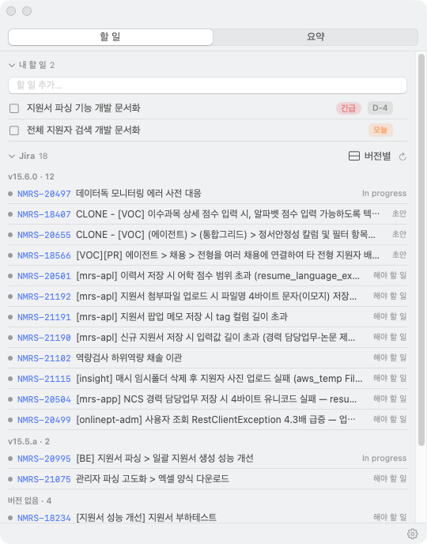
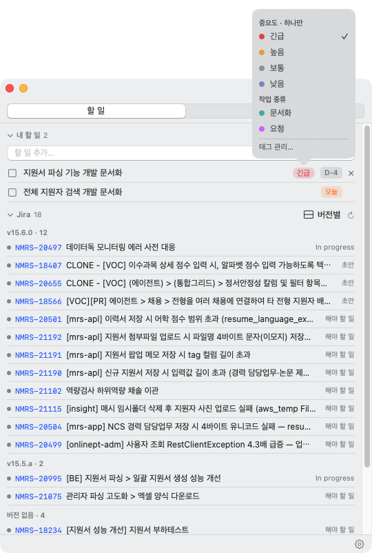
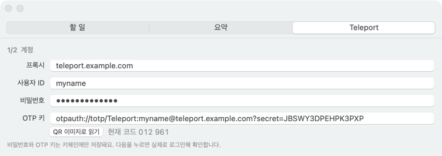
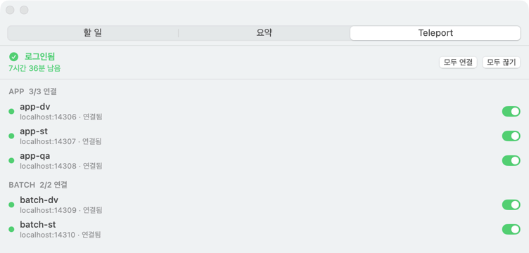
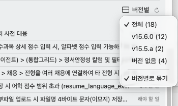
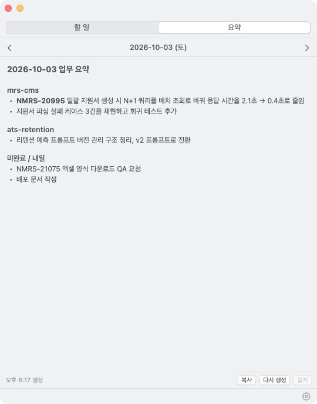
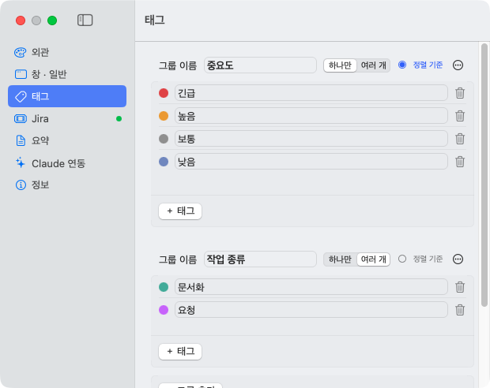
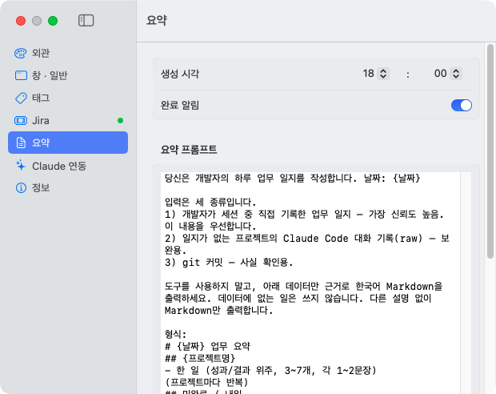
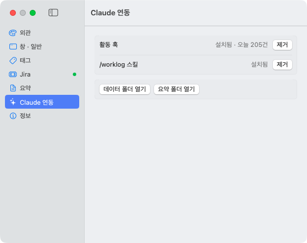
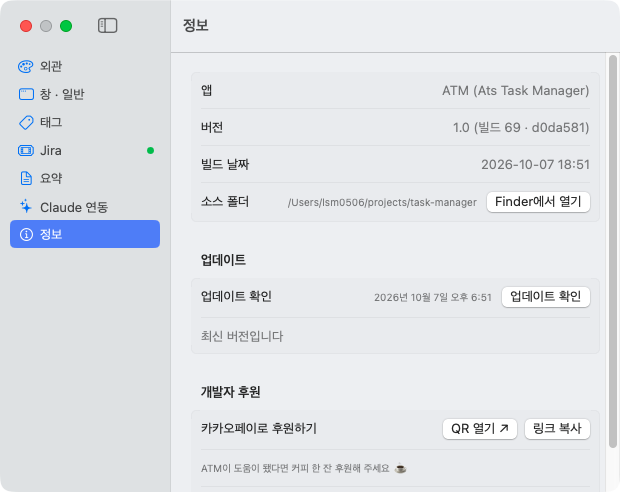

# ATM (Ats Task Manager)

macOS 메뉴바에 상주하는 플로팅 위젯이다. 할 일(마감일 · 태그), 내게 할당된 Jira 미완료 이슈, Claude Code 세션을 바탕으로 한 하루 업무 요약을 한 패널에서 본다.

<p align="center"></p>
<p align="center"><sub>할 일(위)과 Jira 이슈(아래)를 한 화면에 모아 보여 준다.</sub></p>

## 설치

### 준비물

- macOS 14 이상
- Xcode 명령줄 도구 (이미 있으면 생략)

```bash
xcode-select --install
swift --version
```

- 저장소 접근 권한: 비공개 GitHub 저장소라 관리자에게 초대를 요청한다.
- 요약 기능을 쓰려면 Claude Code CLI에 로그인되어 있어야 한다.

```bash
claude --version
```

### 설치

```bash
git clone https://github.com/tkdals2317/mac-task-manage-widget.git
cd mac-task-manage-widget
make install
open ~/Applications/ATM.app
```

앱은 `~/Applications/ATM.app` 에 설치된다. `make install` 은 먼저 `make doctor` 로 환경을 점검하고, ❌ 가 있으면 안내 메시지와 함께 멈춘다.

> **Claude Code로 설치하기**: Claude Code 에 아래를 붙여넣는다.
>
> "https://github.com/tkdals2317/mac-task-manage-widget 를 ~/mac-task-manage-widget 에 클론하고 README 설치 순서대로 설치해줘. 먼저 make doctor 를 돌려서 ❌ 가 있으면, 나한테 sudo ./scripts/fix-clt.sh 한 줄만 실행해 달라고 해."

### 처음 설정

메뉴바 아이콘(또는 Dock 아이콘)으로 패널을 열고 맨 아래 ⚙(설정)을 누른다.

1. **Jira**: Jira 주소(예: `https://your-site.atlassian.net`)와 이메일을 입력하고 "토큰 발급 ↗"로 API 토큰을 만들어 붙여넣은 뒤 저장 → 연결 테스트. 키체인 창이 뜨면 **항상 허용**을 누른다 (창이 싫으면 설정 > 창·일반 > 비밀 정보 저장 에서 **파일**을 고를 수 있다).
2. **Claude 연동**: "활동 훅 설치", "/worklog 스킬 설치", "할 일 추가 스킬 (atm-todo) 설치". 훅은 새 Claude Code 세션부터 기록한다.
   - atm-todo 스킬을 설치하면 Claude Code 에서 "이거 할 일에 추가해줘, 금요일까지" 처럼 말해 ATM 할 일을 추가할 수 있다. 내부적으로 `ATM.app/Contents/MacOS/TaskWidget --add-todo --title "..." [--due YYYY-MM-DD] [--tag 이름] [--memo "..."]` 를 실행하며, 앱이 꺼져 있으면 다음 실행 때 반영된다. 앱을 옮기면 스킬을 다시 설치한다.
3. **창·일반**: "로그인 시 실행"을 켠다.
4. **요약**: 생성 시각을 확인한다 (기본 18:00).

## 사용 설명서

### 할 일

- 입력창에 적고 Enter 를 누르면 추가된다.
- 📅/배지를 눌러 마감일을 정한다 (오늘 / 내일 / 다음 주 월 / 마감 없음 또는 달력). 지난 마감은 빨강, 오늘은 주황으로 표시된다.
- 제목을 더블클릭하면 바로 수정된다 (Enter 저장, Esc 취소).
- 노란 버튼은 패널을 Dock 으로 최소화한다. Dock 아이콘이나 메뉴바 아이콘을 누르면 다시 나타난다.
- 설정 > 창·일반 > 탭에서 할 일/요약 탭을 켜고 끌 수 있다 (하나만 켜면 탭 바가 숨겨진다).

**태그**



<sub>할 일 오른쪽의 태그 영역을 누르면 그룹별 태그 선택 팝오버가 열린다. "중요도"는 하나만, "작업 종류"는 여러 개 고를 수 있다.</sub>

- 태그는 그룹에 속하고, 그룹마다 "하나만"(같은 그룹에서 하나만 붙음) 또는 "여러 개"를 고른다.
- 태그 영역(없으면 호버 시 "＋태그")을 누르거나 우클릭 메뉴(그룹별 하위 메뉴)로 토글한다.
- 행에는 그룹 순서 → 태그 순서대로 최대 2개와 "+N" 이 보인다.
- "태그 순서로 정렬"(기본 켜짐)이면 "정렬 기준" 그룹의 태그 순서 → 마감 → 생성 순으로 정렬된다 (그 그룹 태그가 없는 할 일은 뒤).
- 그룹·태그 추가/삭제/이름 변경/드래그 순서, 색 지정, 기본값 복원은 설정 > 태그에서 한다.

### Teleport

DB 접속용 Teleport 터널을 ATM 안에서 켜고 끈다. 로그인(비밀번호 + OTP)은 ATM 이 대신 입력한다.

**준비물**

- `tsh` 설치 (`make doctor` 가 확인한다. 없으면 탭에 설치 링크가 나온다).
- Teleport 사용자 ID, 비밀번호, OTP 키. OTP 키는 아래 중 하나면 된다.
  - base32 키 문자열
  - `otpauth://totp/...?secret=...` 주소 (OTP 앱·브라우저 확장에서 내보낸 것)
  - OTP 등록 QR 코드 캡처 이미지 ("QR 이미지로 읽기")
  - OTP 키를 어디서 구하는지 모르겠으면 → [OTP 키 구하는 법](docs/otp-key.md) (휴대폰 OTP 앱 / 브라우저 확장별 안내)

**처음 설정**

1. 설정 > 창·일반 > 탭에서 **Teleport** 를 켠다 (기본 꺼짐).
2. Teleport 탭의 **1/2 계정** 에서 프록시, 사용자 ID, 비밀번호, OTP 키를 넣는다.
   - 사용자 ID 는 Teleport 계정이다. DB 사용자(`developer`)가 아니다. OTP 주소를 넣으면 계정이 자동으로 채워진다.
   - OTP 키 아래 "현재 코드" 6자리가 휴대폰/확장의 OTP 와 같으면 키가 맞다.

   

3. **다음** 을 누르면 실제로 로그인해 확인하고, 통과하면 비밀번호·OTP 키를 저장한다 (기본 키체인, 설정 > 창·일반 > 비밀 정보 저장 에서 파일로 바꿀 수 있다).
4. **2/2 DB 선택** 에서 `tsh db ls` 로 불러온 DB 를 체크한다. 포트는 4306 부터 자동으로 채워지고(수정 가능, 겹치면 빨간색), 운영 DB 는 빨간 "운영" 표시에 기본 선택되지 않는다. **N개 저장** 을 누른다.

**사용**



- **모두 연결 / 모두 끊기**, 또는 DB 별 토글로 켜고 끈다. 필요하면 저장된 비밀번호와 OTP 로 자동 로그인한다.
- 토글과 점은 실제 상태를 보여준다: 초록 연결됨, 주황 연결 중, 회색 끊김, 빨강 실패(이유가 아래 줄에 나온다).
- **자동 유지**: 1분마다 켜 둔 터널이 응답하는지 확인한다. 로그인이 만료됐으면 자동으로 다시 로그인하고, 죽은 터널은 다시 연결한다. 3번 연속 실패하면 빨간색으로 멈추니 토글로 다시 켠다.
- DB 툴 접속 정보: 호스트 `localhost`, 해당 포트, DB 사용자(기본 `developer`), 비밀번호 없음.
- **자동 재연결**: ATM 을 켜면 마지막에 켜 두었던 DB 를 자동으로 다시 연결한다(로그인이 필요하면 자동 로그인). 설정 > Teleport 에서 끌 수 있다.
- ATM 을 끄면(업데이트·`make install` 포함) ATM 이 연 터널을 닫고 `tsh logout` 한다. 다음에 켜면 위 자동 재연결이 다시 연다.
- 다른 프로그램이 그 포트를 쓰고 있으면 "포트 사용 중"으로 표시만 하고 건드리지 않는다.

**설정 바꾸기**

- 계정이나 DB 목록을 바꾸려면 설정 > Teleport > **설정 다시 하기**.
- 그룹 이름은 DB 이름의 첫 부분(`app-dv` → APP)이다. 바꾸려면 설정 > Teleport > **teleport.json 열기** 에서 해당 DB 에 `"group": "원하는 이름"` 을 넣는다.
- 저장 위치: 비밀번호·OTP 키는 키체인(`com.lsm0506.TaskWidget.teleport`) 또는 `secrets.json`(저장 위치 설정에 따름), DB 목록은 `~/Library/Application Support/TaskWidget/teleport.json`, 터널 로그는 `logs/teleport-<이름>.log`.

**문제 해결**

- `ERROR: invalid username, password or second factor`: 사용자 ID 가 Teleport 계정인지(`developer` 아님), 비밀번호, OTP 키를 확인하고 설정 다시 하기.
- 키체인 창이 뜨면 **항상 허용** (업데이트 직후 한 번). 매번 뜨는 게 싫으면 설정 > 창·일반 > 비밀 정보 저장 을 **파일**로 바꾼다.

### Jira

- 내게 할당된 미완료 이슈가 상태별로 나온다. 이슈를 누르면 브라우저에서 열린다. 설정 > Jira 에서 JQL 을 바꿀 수 있다.
- 이슈 행 오른쪽에 회색 **수정 버전 태그**가 붙는다 (`PROJ_v1.2` 처럼 모든 버전에 붙은 공통 접두어 `PROJ_` 는 숨김).
- 헤더의 버전 pill 로 **버전별 필터**를 건다 (× 로 해제).
- 메뉴의 "버전별로 묶기"를 켜면 버전 그룹으로 표시된다. 선택은 재실행 후에도 유지된다.



<sub>버전 pill 메뉴. 버전별 이슈 개수를 보고 필터를 고르거나 "버전별로 묶기"를 켠다.</sub>

### 오늘 업무 요약



<sub>요약 탭. 위쪽 화살표로 날짜를 옮기고, 아래에서 복사 · 다시 생성 · 일지를 쓴다.</sub>

- 매일 설정한 시각(기본 18:00)에 자동 생성된다. 그 시각에 앱이 꺼져 있었다면 다음 실행 때 지난 7일 안의 빠진 날을 채운다.
- 입력 자료
  - Claude Code 세션에서 `/worklog` 로 남긴 일지: 가장 신뢰하는 입력.
  - 활동 훅이 모은 Claude Code 대화 기록: 일지가 없는 프로젝트를 보완.
  - git 커밋: 사실 확인용.
- 요약은 `claude -p` 로 만들므로 Claude Code CLI 구독을 쓴다.
- "다시 생성"으로 다시 만들고, "복사"로 클립보드에 담고, 화살표로 다른 날짜를 본다.
- 메뉴바 아이콘 우클릭 > "요약 지금 생성"으로 바로 만들 수도 있다.

### 설정

| 섹션 | 내용 |
|---|---|
| 외관 | 투명도, 호버, 테마, 글자 크기 |
| 창·일반 | 항상 위, Spaces, 탭 켜고 끄기, 로그인 시 실행 |
| 태그 | 그룹/태그 관리, 색, 정렬 기준, 기본값 복원 |
| Jira | 이메일·토큰, 연결 테스트, JQL |
| 요약 | 생성 시각, 완료 알림, 요약 프롬프트, claude 경로 |
| Claude 연동 | 활동 훅과 `/worklog` 스킬 설치·제거, 데이터/요약 폴더 열기 |
| 정보 | 버전·빌드, 업데이트 확인, 개발자 후원 |

<table>
<tr>
<td><br><sub>태그: 그룹별 하나만/여러 개, 정렬 기준, 태그 색과 순서.</sub></td>
<td><br><sub>요약: 생성 시각과 요약 프롬프트. 프롬프트의 <code>{날짜}</code> 는 해당 날짜로 치환되고, 데이터는 자동 첨부된다.</sub></td>
</tr>
<tr>
<td><br><sub>Claude 연동: 활동 훅과 /worklog 스킬의 설치 상태.</sub></td>
<td><br><sub>정보: 버전, 업데이트 확인, 개발자 후원(카카오페이 QR).</sub></td>
</tr>
</table>

## 업데이트

설정 > 정보 > **업데이트 확인**에서 새 커밋을 확인하고 **업데이트** 버튼을 한 번 누르면 갱신된다 (`git pull --ff-only` + `make install`, 끝나면 앱이 다시 열린다). 새 버전이 있으면 패널 하단에 "업데이트 있음 (N)"이 뜨고, 6시간마다 자동으로 확인한다. 소스 폴더에 커밋하지 않은 수정이 있으면 업데이트가 거부된다. 실패 로그는 `~/Library/Application Support/TaskWidget/logs/update.log` 에 남는다.

수동으로 하려면 소스 폴더에서 다음을 실행한다.

```bash
git pull
make install
```

재설치할 때마다 처음 Jira 를 불러올 때 키체인 창이 한 번 뜬다. **항상 허용**을 누르면 그 버전에서는 다시 묻지 않는다. 창이 떠 있어도 앱은 멈추지 않는다.

## 문제 해결

- **문제가 생기면**: 설정 > 정보 > 진단 정보 내보내기 → 바탕화면 zip 을 개발자에게 전달 (로그·환경 요약만 담기고 비밀번호·OTP·토큰은 들어가지 않는다).
- **빌드 중 `Invalid manifest` / `redefinition of module 'SwiftBridging'`**: 예전 명령줄 도구의 잔여 파일 때문이다. `make doctor` 로 확인하고 `sudo ./scripts/fix-clt.sh` 를 실행한다 (파일은 삭제하지 않고 `/Library/Developer/CLT-stale-backup/` 으로 옮긴다). 또는 `sudo rm -rf /Library/Developer/CommandLineTools && xcode-select --install` 로 재설치한다.
- **패널이 안 보임**: 메뉴바 아이콘이나 Dock 아이콘을 클릭한다.
- **Jira 에 "Jira 주소를 입력하세요"**: 업데이트로 기본 주소가 빠졌다. 설정 > Jira 에 회사 Jira 주소(`https://<사이트>.atlassian.net`)를 넣는다.
- **Jira 401**: 토큰을 다시 발급해 저장한다.
- **요약 실패 `claudeNotFound`**: 터미널에서 `command -v claude` 로 경로를 확인해 설정 > 요약 > claude 경로에 입력한다 (또는 **자동 찾기**).
- **요약이 "기록 없음"**: 활동 훅이 설치됐는지, 훅 설치 이후의 새 세션인지 확인한다.
- **키체인 창이 앱을 켤 때마다 뜸**: "허용" 대신 **항상 허용**을 눌렀는지 확인한다. 재설치 직후 한 번 뜨는 건 정상이다. Apple 개발자 팀 ID 없이 빌드한 앱이라 macOS 가 새 버전마다 다시 묻는다. 설정 > 창·일반 > 비밀 정보 저장 을 **파일**로 바꾸면 더는 뜨지 않는다 (대신 평문 저장, 아래 참고).
- **앱을 옮긴 뒤 훅이 동작하지 않음**: `~/.claude/settings.json` 의 훅 경로가 깨진 것이다. 설정 > Claude 연동에서 "재설치"한다.
- **이전 이름(TaskWidget.app)에서 업그레이드**: 설정 > Claude 연동에서 활동 훅을 재설치하고, 로그인 시 실행을 껐다 켠다.
- **삭제**: 먼저 설정 > Claude 연동에서 훅·스킬을 제거한 뒤, `~/Applications/ATM.app` 을 휴지통으로 옮기고 데이터 폴더 `~/Library/Application Support/TaskWidget/` 를 삭제한다.

## 데이터와 개인정보

모든 데이터는 내 Mac 안에 있다. 위치는 `~/Library/Application Support/TaskWidget/` 이다.

- `todos.json`, `tags.json`: 할 일과 태그
- `activity.jsonl`: 활동 훅이 남기는 Claude Code 활동 기록. **내가 입력한 프롬프트가 들어 있다.**
- `worklog/`: `/worklog` 로 남긴 일지
- `summaries/`: 생성된 요약
- `logs/`: 업데이트 등 로그
- 비밀 정보(Jira API 토큰, Teleport 비밀번호·OTP 키)는 기본적으로 키체인(`com.lsm0506.TaskWidget.jira`, `com.lsm0506.TaskWidget.teleport`)에 저장된다. 설정 > 창·일반 > 비밀 정보 저장 에서 **파일**을 고르면 `secrets.json` 에 **암호화 없이** 저장된다 (권한 600, 내 계정만 읽기 가능). 저장소 밖이라 git 에 올라가지 않는다. 전환하면 기존 값을 새 위치로 옮기고 이전 위치에서 지운다.

외부로 나가는 통신은 Jira API 호출과 로컬 `claude` CLI 실행(요약 생성)뿐이다. 그 외 서버로 데이터를 보내지 않는다.

## 개발자용

```bash
make build     # swift build
make test      # swift test (Core 단위 테스트)
make app       # build/ATM.app 생성 (로그인 키체인의 "TaskWidget Dev" 인증서로 서명, 없으면 ad-hoc)
make install   # ~/Applications/ATM.app 설치
make run       # build/ATM.app 실행
```

- 앱 아이콘: `swift scripts/make-icon.swift` 로 다시 생성한다 (`Resources/AppIcon.icns`).
- 설계 문서: `docs/superpowers/specs/2026-10-02-task-widget-design.md`
- 릴리스: `VERSION` 을 올리고(기능 추가 = minor, 버그 수정 = patch) `CHANGELOG.md` 맨 위에 `## <버전> — <날짜>` 섹션을 추가한다 (사용자 입장의 짧은 한글 항목). 같은 PR에 넣는다. 머지 후 원하면 `git tag v<버전> && git push origin v<버전>`.
- 릴리스 전 확인 목록: [docs/manual-test-checklist.md](docs/manual-test-checklist.md)
